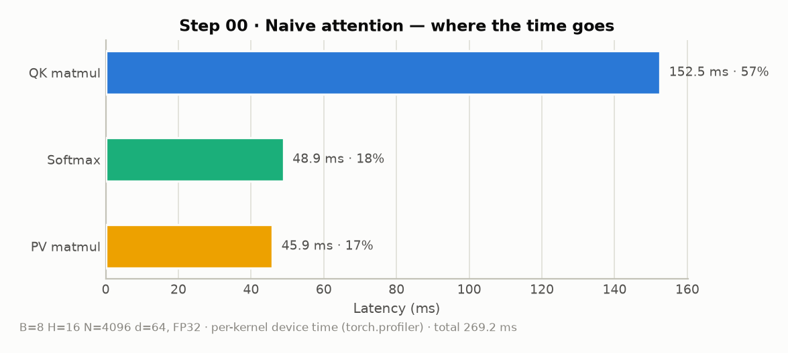
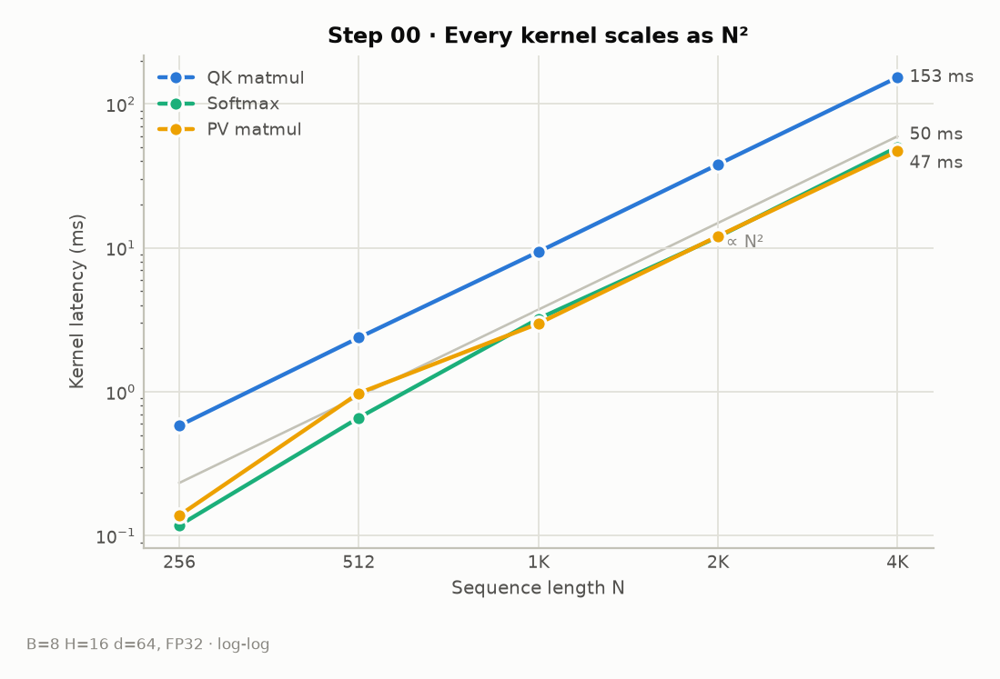
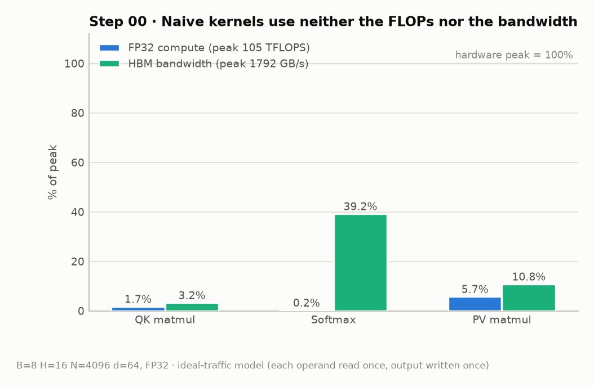

# Step 00 · Naive Standard Attention (Baseline)

> One thread per output element, one thread per softmax row, and the full
> N×N score matrix materialized in HBM. **269 ms** at B=8 H=16 N=4096 d=64 —
> the baseline every later step is measured against.

- Code: [`steps/00_naive/kernels.cu`](../steps/00_naive/kernels.cu) ·
  [`attention.cu`](../steps/00_naive/attention.cu)
- Measurement script: [`benchmarks/bench_step00.py`](../benchmarks/bench_step00.py) ·
  raw numbers: [`benchmarks/results/step00.json`](../benchmarks/results/step00.json)

## What this step implements

Three separate kernels, one per stage of standard attention, with the
intermediate `S = scale·QKᵀ` and `P = softmax(S)` matrices stored in HBM:

1. `naive_qk_kernel` — one thread per element of S (16×16 blocks)
2. `naive_softmax_kernel` — one thread per row: max pass → exp-sum pass → normalize pass
3. `naive_pv_kernel` — one thread per element of O

<!-- TODO: attention 수식, scale 의미, 왜 3-pass softmax(수치 안정성)인지 조사해서 채우기 -->

## Measurements

### Where the time goes

| Kernel | Latency | Share | Achieved | % of FP32 peak | Effective BW | % of HBM peak |
|---|---:|---:|---:|---:|---:|---:|
| QK matmul | 152.5 ms | 57 % | 1.8 TFLOPS | 1.7 % | 58 GB/s | 3.2 % |
| Softmax | 48.9 ms | 18 % | ~0 | 0.2 % | 702 GB/s | 39 % |
| PV matmul | 45.9 ms | 17 % | 6.0 TFLOPS | 5.7 % | 193 GB/s | 10.8 % |

<!-- TODO: QK가 PV보다 3배 느린 이유 (K 행 접근 패턴, 캐시 재사용) 분석 -->

### Every kernel scales as N²

### Neither the FLOPs nor the bandwidth are used

The naive kernels sit in the worst corner: far below the FP32 peak
(104.8 TFLOPS) *and* far below the HBM peak (1792 GB/s; 1513 GB/s measured
with a D2D copy). Two independent problems, fixed by different steps:

- compute efficiency of the two GEMMs → step 01 (cuBLAS)
- memory efficiency of the softmax → steps 02–03
- the N² HBM round-trips themselves → step 04 (fusion)

## Concepts to cover (TODO)

- [ ] Standard attention의 메모리 접근 복잡도 O(N²) 유도
- [ ] memory-bound vs compute-bound, arithmetic intensity 정의
- [ ] thread/block/grid 매핑이 성능에 미치는 영향
- [ ] 3-pass softmax와 수치 안정성 (max subtraction)

## Next

→ [Step 01 · cuBLAS GEMM](01_cublas.md): replace the two hand-written matmuls
with library GEMMs and see what the profile looks like when the matmuls are fast.
