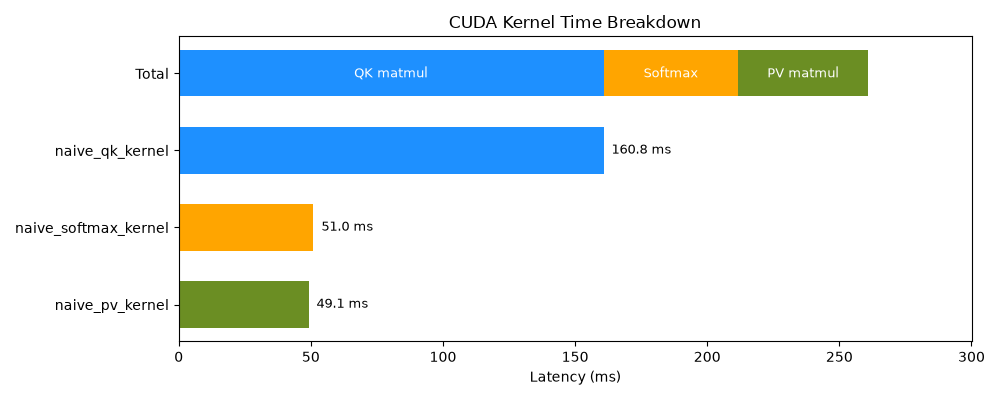
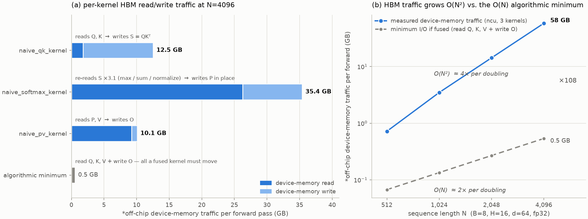

# Step 0. Naive Standard Attention (Baseline)

## What this step implements

Three separate kernels, with the intermediate `S = scale·QKᵀ` and `P = softmax(S)` matrices stored in HBM:

1. `naive_qk_kernel` — one thread per element of S (16×16 blocks)
2. `naive_softmax_kernel` — one thread per row
3. `naive_pv_kernel` — one thread per element of O (32×8 blocks)

## Measurements

### Kernel breakdown

### HBM traffic — why this is the bottleneck

The kernels communicate through HBM:

1. `S` (N×N) is written by `naive_qk_kernel`
2. `S` (N×N) is re-read ×3 by `softmax_kernel` (max, sum, normalize)
3. `S` (N×N) is read again by `naive_pv_nernel`

Naive attention materializes N×N score/probability matrices, causing O(N²) off-chip memory traffic.  
The gray line shows the ideal $O(N)$ I/O lower bound, not the compute complexity of attention.

#### Note

\*In FlashAttention literature, this is often referred to as HBM traffic.   
On RTX 5090, which uses GDDR7 instead of HBM, We measure the same off-chip device-memory traffic.

