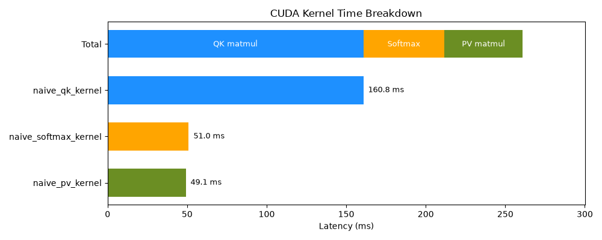

# Step 0. Naive Standard Attention (Baseline)

## What this step implements

A straightforward CUDA implementation of standard attention:

$$
S = \mathrm{scale} \cdot QK^\top,\qquad
P = \mathrm{softmax}(S),\qquad
O = PV
$$

The computation is split into three separate kernels, with the full $(N \times N)$ attention matrix materialized in device memory.

## Baseline design

### QKᵀ

Each thread computes one element of the score matrix:

```cuda
float acc = 0.0f;
for (int k = 0; k < d; ++k) {
    acc += Qb[row * d + k] * Kb[col * d + k];
}
Sb[row * N + col] = acc * scale;
```

No shared-memory tiling or data reuse is applied.

### Softmax

Each thread processes one complete row sequentially:

```cuda
for (int j = 0; j < N; ++j)
    max_val = fmaxf(max_val, row[j]);

for (int j = 0; j < N; ++j)
    sum += __expf(row[j] - max_val);

for (int j = 0; j < N; ++j)
    row[j] = __expf(row[j] - max_val) / sum;
```

This requires three passes over $N$ elements for max, exponential sum, and normalization.

### PV

Each thread computes one output element:

```cuda
float acc = 0.0f;
for (int k = 0; k < N; ++k) {
    acc += Pb[row * N + k] * Vb[k * d + col];
}
```

Again, no tiling or reuse of `P` and `V` is applied.

## Bottleneck



The key bottleneck is the materialization of the $(N \times N)$ score/probability matrix in off-chip memory.


For each attention operation:

1. `QKᵀ` writes the $(N \times N)$ score matrix.
2. Softmax reads the score matrix repeatedly for max, sum, and normalization.
3. `PV` reads the normalized $(N \times N)$ matrix again.

This produces $O(N^2)$ device-memory traffic in addition to the attention computation itself.

> Following FlashAttention terminology, HBM traffic refers to off-chip device-memory traffic; on RTX 5090, this is GDDR7.
