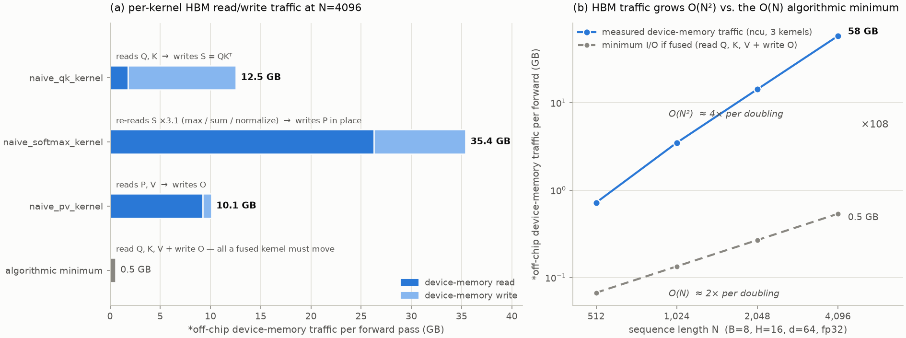

# Step 0. Naive Standard Attention (Baseline)

## What this step implements

A straightforward CUDA implementation of standard attention:

$$
S = \mathrm{scale} \cdot QK^\top,\qquad
P = \mathrm{softmax}(S),\qquad
O = PV
$$

The computation is split into three separate kernels, with the full $(N \times N)$ attention matrix materialized in device memory.

## Baseline design

### QKᵀ

Each thread computes one element of the score matrix:

```cuda
float acc = 0.0f;
for (int k = 0; k < d; ++k) {
    acc += Qb[row * d + k] * Kb[col * d + k];
}
Sb[row * N + col] = acc * scale;
```

No shared-memory tiling or data reuse is applied.

### Softmax

Each thread processes one complete row sequentially:

```cuda
for (int j = 0; j < N; ++j)
    max_val = fmaxf(max_val, row[j]);

for (int j = 0; j < N; ++j)
    sum += __expf(row[j] - max_val);

for (int j = 0; j < N; ++j)
    row[j] = __expf(row[j] - max_val) / sum;
```

This requires three passes over $N$ elements for max, exponential sum, and normalization.

### PV

Each thread computes one output element:

```cuda
float acc = 0.0f;
for (int k = 0; k < N; ++k) {
    acc += Pb[row * N + k] * Vb[k * d + col];
}
```

Again, no tiling or reuse of `P` and `V` is applied.

## Why this baseline is inefficient

The implementation exposes three major problems.

### 1. No explicit data reuse

Both matrix multiplications operate directly on global-memory data without shared-memory tiling.

The same `Q`, `K`, `P`, and `V` values are therefore consumed repeatedly by different threads instead of being explicitly staged and reused on chip.

### 2. Sequential softmax

A single thread processes an entire attention row.

The max reduction, exponential sum, and normalization are all performed serially, leaving substantial parallelism unused.

### 3. Materialized attention matrices

The full score and probability matrices are stored in device memory between kernels.

For each attention operation:

1. `QKᵀ` writes the $(N \times N)$ score matrix.
2. Softmax repeatedly reads and updates that matrix.
3. `PV` reads the normalized $(N \times N)$ matrix again.



This introduces $O(N^2)$ intermediate device-memory traffic in addition to the arithmetic required by attention itself.

> Following FlashAttention terminology, HBM traffic refers to off-chip device-memory traffic; on RTX 5090, this is GDDR7.

## Nsight Compute summary

Nsight Compute confirms that these design choices produce different bottlenecks across the three kernels.

For `B=8, H=16, N=4096, d=64`:

| Kernel  | Main observation                                                 |
| ------- | ---------------------------------------------------------------- |
| `QKᵀ`   | 99.6% L1/TEX vs. 2.6% DRAM, with inefficient memory transactions |
| Softmax | 1.0% SM throughput and ~0.02 eligible warps/scheduler             |
| `PV`    | 90% SM/L1 utilization with ~58% Long Scoreboard stalls           |

The baseline is **not simply DRAM-bandwidth bound**.

Its performance is limited by inefficient memory access, low parallelism, long dependency chains, and poor data reuse.

Detailed profiler metrics and stall analysis are documented separately:

→ [Nsight Compute Analysis — Step 00](ncu/00_naive.md)

## Conclusion

The naive implementation establishes the baseline and exposes the two problems that drive the following optimizations:

* inefficient scalar kernels
* repeated global-memory reads and writes of the $N \times N$ attention matrix

The next steps first optimize the individual operations before moving toward tiled, fused attention that keeps intermediate state on chip.

