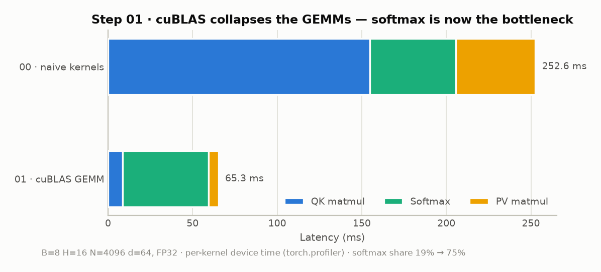
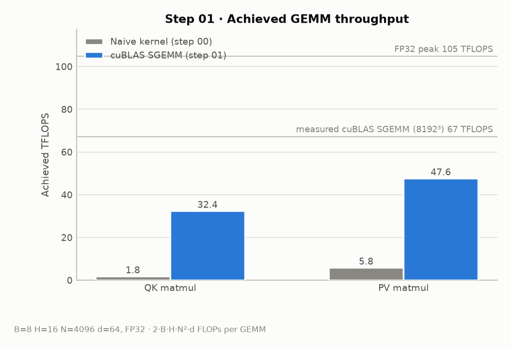

# Step 01 · cuBLAS GEMM

> Replacing the two hand-written matmuls with `cublasSgemmStridedBatched`
> collapses the GEMM time 26× (154.8 → 8.5 ms and 47.1 → 5.8 ms).
> End-to-end drops **268 → 68 ms**, and the untouched naive softmax now
> owns **75 %** of the runtime — Amdahl's law in one chart.

- Code: [`steps/01_cublas/kernels.cu`](../steps/01_cublas/kernels.cu) ·
  [`attention.cu`](../steps/01_cublas/attention.cu)
- Measurement script: [`benchmarks/bench_step01.py`](../benchmarks/bench_step01.py) ·
  raw numbers: [`benchmarks/results/step01.json`](../benchmarks/results/step01.json)

## What this step implements

- `S = scale·QKᵀ` and `O = PV` via `cublasSgemmStridedBatched` (one batched
  call for all B·H heads each)
- cuBLAS is column-major, tensors are row-major: compute `Cᵀ = Bᵀ·Aᵀ`
  instead of `C = A·B` (see the comments in `kernels.cu` for the exact
  argument mapping)
- softmax kernel unchanged from step 00

<!-- TODO: row-major ↔ col-major 트릭 상세 설명, strided batched GEMM 파라미터 정리 -->

## Measurements

### The GEMMs collapse — softmax is now the bottleneck

Softmax share of runtime: **19 % → 75 %**. Optimizing the matmuls further is
now pointless until the softmax is fixed.

### Achieved GEMM throughput

| GEMM | Naive (step 00) | cuBLAS (step 01) | Speedup |
|---|---:|---:|---:|
| QK (N×d × d×N) | 1.8 TFLOPS | 32.4 TFLOPS | ~18× |
| PV (N×N × N×d) | 5.8 TFLOPS | 47.6 TFLOPS | ~8× |

A large square SGEMM (8192³) measures ~67 TFLOPS on this GPU, so cuBLAS gets
within about half~two-thirds of the practical FP32 ceiling on these skinny
attention shapes (d=64 limits tile efficiency).

<!-- TODO: cuBLAS가 빠른 이유(타일링, 공유메모리, 레지스터 블로킹, 벡터화) 조사 —
     step 05~06에서 우리가 직접 재현할 기법들의 프리뷰로 연결 -->

## Concepts to cover (TODO)

- [ ] Amdahl's law와 프로파일 기반 최적화 순서 결정
- [ ] cuBLAS strided-batched GEMM API와 leading dimension
- [ ] 라이브러리 GEMM의 내부 구조 (tiling / smem / register blocking) 개요
- [ ] attention shape(d=64)이 GEMM 효율에 주는 제약

## Next

→ [Step 02 · Warp-reduction Softmax](02_warp_softmax.md): the row-per-thread
softmax is now 75 % of the runtime — parallelize the row reduction.
