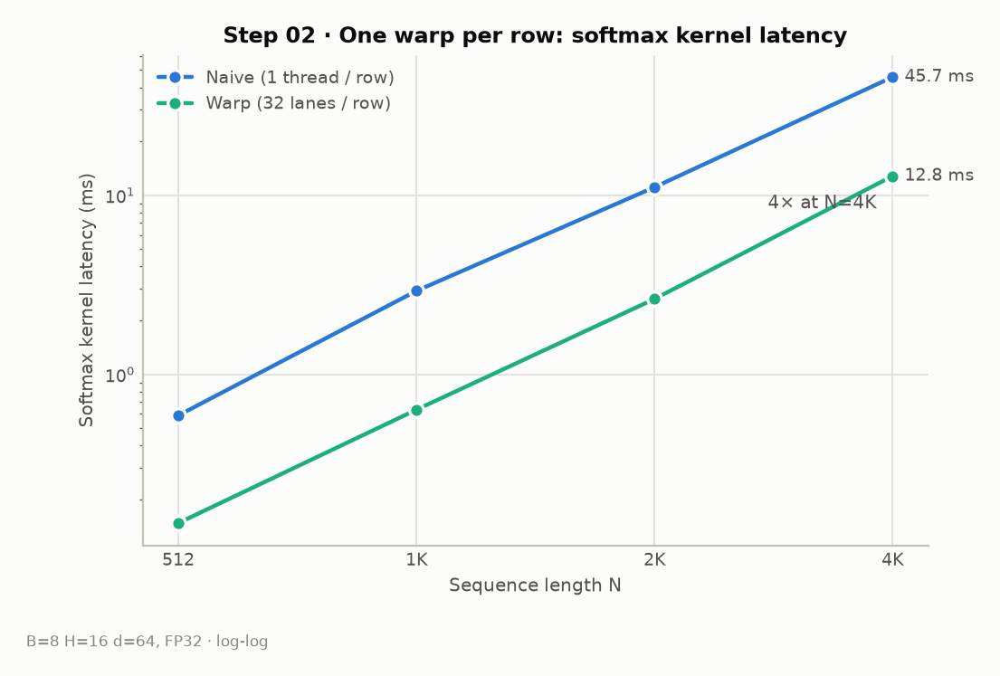
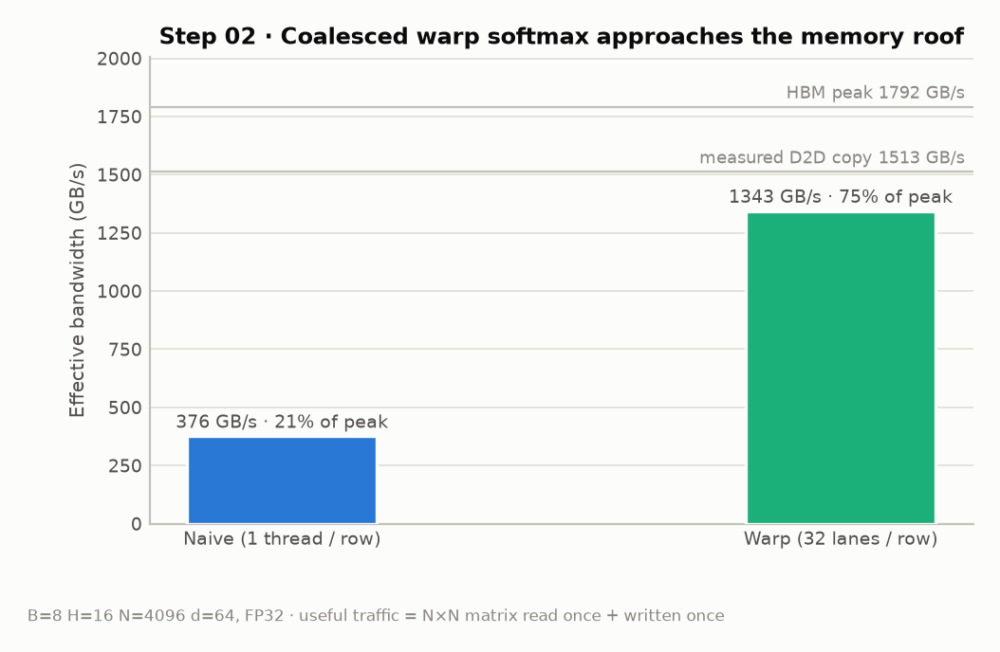
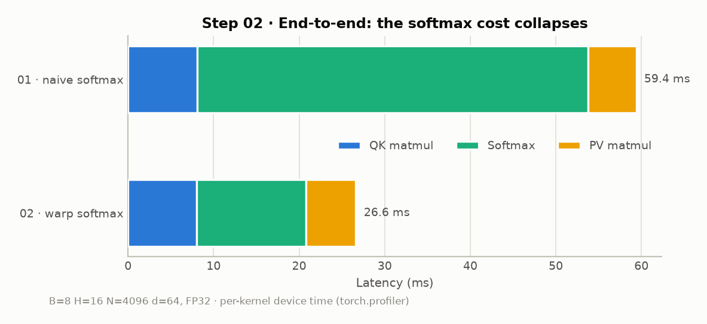

# Step 02 · Warp-reduction Softmax

> One warp per row instead of one thread per row: the softmax kernel drops
> **45.7 → 12.8 ms (3.6×)** and its effective bandwidth rises
> **376 → 1343 GB/s — 75 % of the HBM peak**. End-to-end: 66 → 29 ms.

- Code: [`steps/02_warp_softmax/kernels.cu`](../steps/02_warp_softmax/kernels.cu)
- Measurement script: [`benchmarks/bench_step02.py`](../benchmarks/bench_step02.py) ·
  raw numbers: [`benchmarks/results/step02.json`](../benchmarks/results/step02.json)

## What this step implements

- 32 lanes cooperate on one row: each lane strides by 32, so **consecutive
  lanes read consecutive addresses → coalesced HBM transactions**
- per-lane partial max / sum, then a 5-step `__shfl_xor_sync` butterfly
  reduction merges them within the warp (no shared memory needed)
- still 3 passes over the row: max → exp (written in place) + sum → normalize

<!-- TODO: warp shuffle butterfly reduction 그림, coalescing 규칙(32/64/128B 트랜잭션) 정리 -->

## Measurements

### Softmax kernel latency vs N

### The kernel is now properly memory-bound

"Useful traffic" here is the minimum any softmax must move: the N×N matrix
read once and written once. By that yardstick the warp version reaches
1343 GB/s — between the measured D2D copy ceiling (1513 GB/s) and 75 % of the
spec peak. **There is little headroom left inside this kernel**; going faster
now requires moving less data, not moving it faster.

### End-to-end

| | step 01 | step 02 |
|---|---:|---:|
| Softmax kernel | 45.7 ms | 12.8 ms |
| End-to-end | 66.2 ms | 29.1 ms |

Note that step 02 actually does *more* HBM traffic than step 01's softmax
(3R+2W vs 3R+1W passes — see step 03's traffic model): it wins purely on
access pattern and parallelism, not on bytes moved.

<!-- TODO: naive 버전이 느린 이유를 uncoalesced 접근 + row당 1 thread 직렬화로 분해해서 설명 -->

## Concepts to cover (TODO)

- [ ] warp = lockstep 32 lanes, `__shfl_xor_sync`와 butterfly reduction
- [ ] memory coalescing: 같은 코드에서 접근 패턴만 바꿔 3.6×
- [ ] effective bandwidth 계산법과 "memory roof"에 도달했다는 판단 기준
- [ ] 왜 여기서 더 못 빨라지는가 → 데이터 이동 자체를 줄여야 함 (fusion 복선)

## Next

→ [Step 03 · Online Softmax](03_online_softmax.md): same speed, but computes
(max, sum) in a single pass — the property fusion will need.
