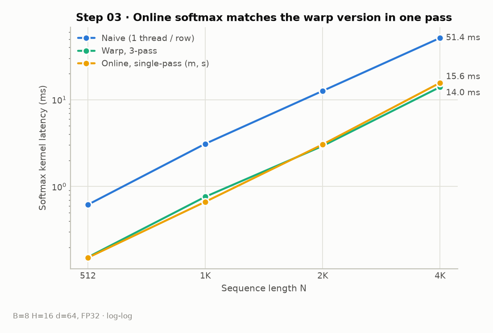
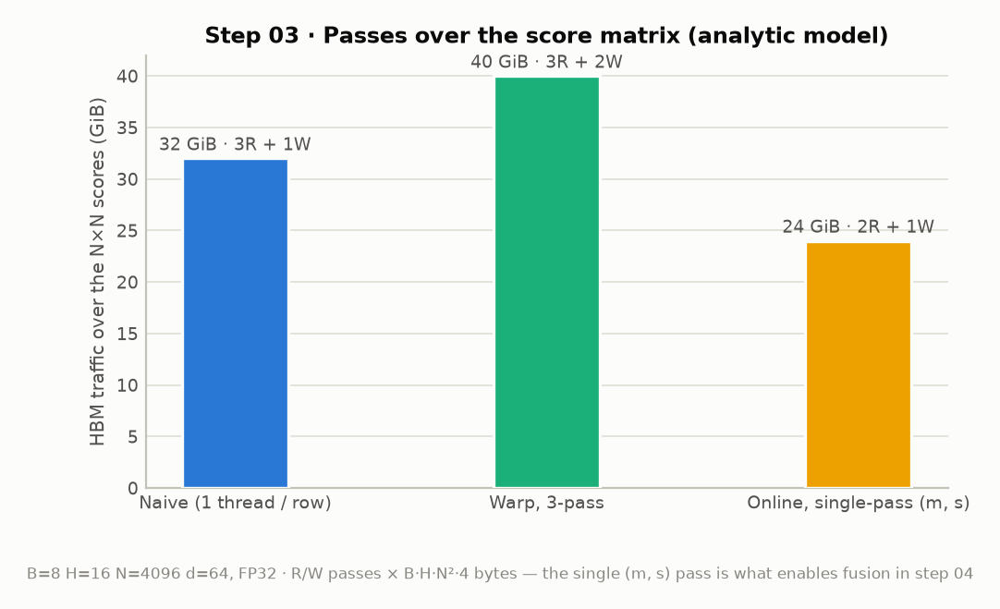

# Step 03 · Online Softmax

> Fold the max pass and the sum pass into one: keep a running (m, s) state and
> rescale s whenever a new max appears. At N=4096 it is roughly on par with the
> warp version (**14.0 vs 15.6 ms**) — the point of this step is not speed but
> the **single-pass property that makes the fusion in step 04 possible**.

- Code: [`steps/03_online_softmax/kernels.cu`](../steps/03_online_softmax/kernels.cu)
- Measurement script: [`benchmarks/bench_step03.py`](../benchmarks/bench_step03.py) ·
  raw numbers: [`benchmarks/results/step03.json`](../benchmarks/results/step03.json)

## What this step implements

The merge rule for two softmax states — and the reason it exists:

```
m_new = max(m_a, m_b)
s_new = s_a · exp(m_a − m_new) + s_b · exp(m_b − m_new)
```

- one pass updates (m, s) per lane; a new element x is merged as the state (x, 1)
- the same rule merges the 32 per-lane states in the warp reduction
- init with `-FLT_MAX`, not `-inf` (merging two empty `-inf` states would
  produce `exp(-inf − (-inf)) = NaN`)
- branch on the rare new-max case so the common path keeps the loop-carried
  dependency to a single add (see the comment in `kernels.cu`)

<!-- TODO: online softmax 유도 (Milakov & Gimelshein 2018), 결합법칙/교환법칙이
     성립해서 어떤 순서로 merge해도 되는 이유 정리 -->

## Measurements

### Latency: on par with the warp version



| Softmax kernel (N=4096) | naive | warp 3-pass | online |
|---|---:|---:|---:|
| Latency | 51.4 ms | 14.0 ms | 15.6 ms |
| End-to-end | 73.0 ms | 32.0 ms | 33.1 ms |

Online softmax is ~10 % slower than the 3-pass warp version here — the exp
rescaling adds ALU work while the kernel is bandwidth-limited either way.

<!-- TODO: 왜 traffic이 3/5 (2R+1W vs 3R+2W)인데 더 빠르지 않은지 분석
     (정규화 패스가 여전히 병목? L2? exp 처리량?) — ncu로 확인해볼 것 -->

### Traffic model: one read pass disappears



The real prize is architectural: **(m, s) can now be maintained while
streaming the row once**. That is exactly what a fused kernel needs — in
step 04 the "row" arrives tile by tile from SRAM and is never written to HBM
at all, so a softmax that needs a second global pass would be impossible.

## Concepts to cover (TODO)

- [ ] online softmax 점화식 유도와 수치 안정성 증명
- [ ] 상태 (m, s)의 monoid 구조 — warp reduction과 타일 병합에 같은 규칙 사용
- [ ] "같은 속도인데 왜 하는가": fusion의 전제조건이라는 관점
- [ ] FlashAttention 논문의 online softmax와의 연결

## Next

→ [Step 04 · Naive Fused Attention](04_naive_fused.md): use the (m, s) merge
rule to compute attention tile-by-tile in SRAM, never materializing S in HBM.
