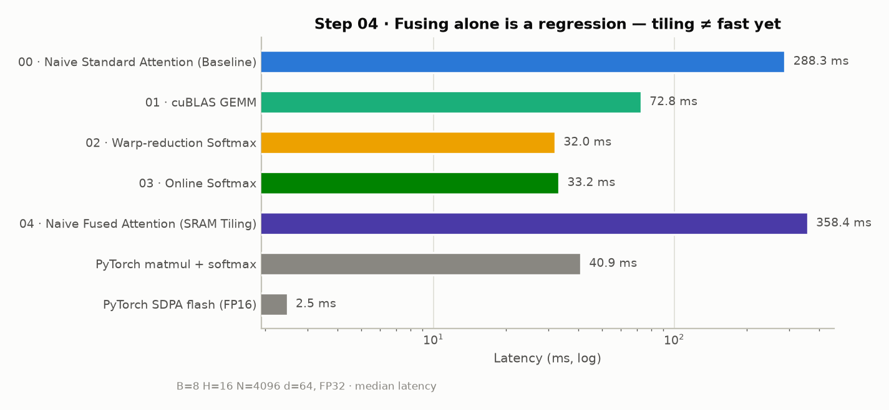
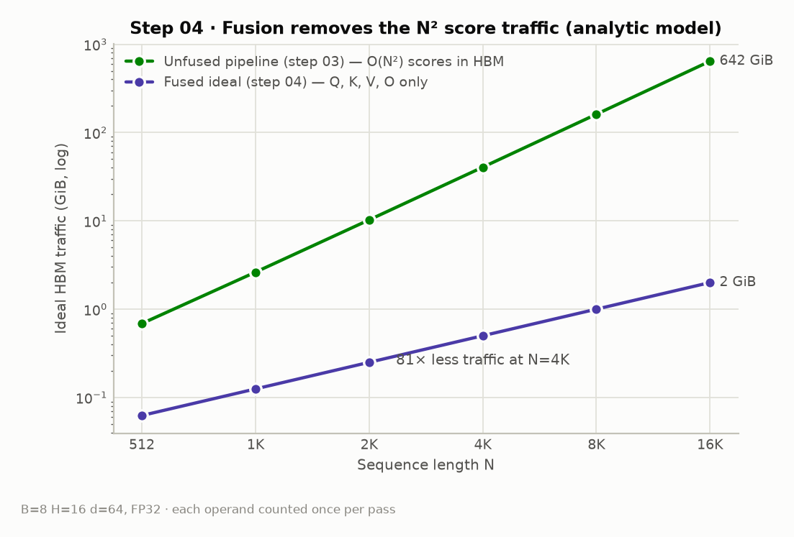
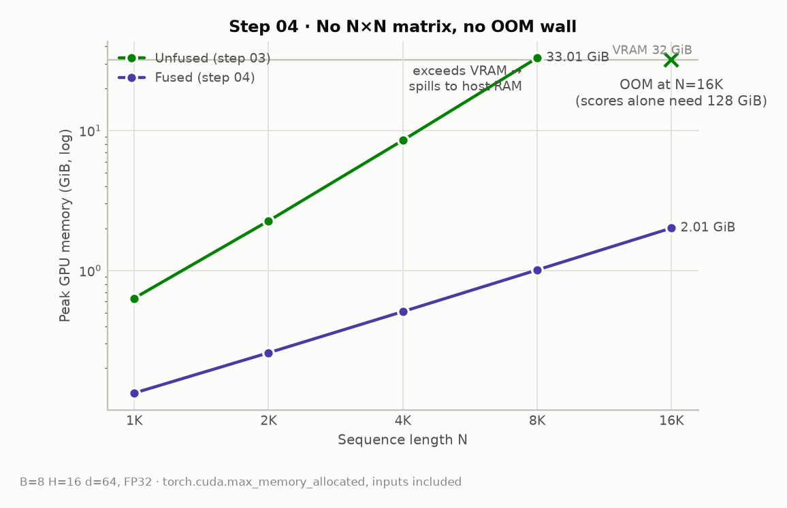
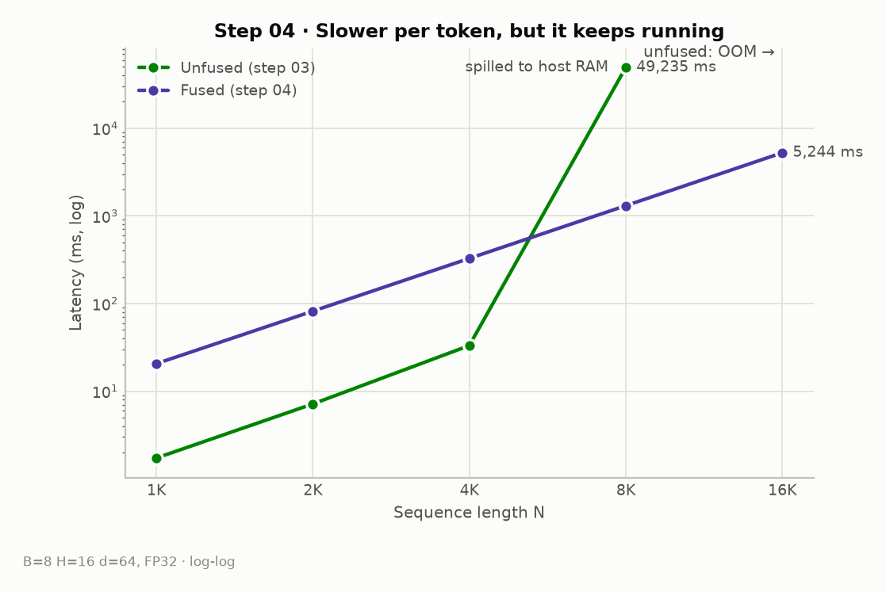
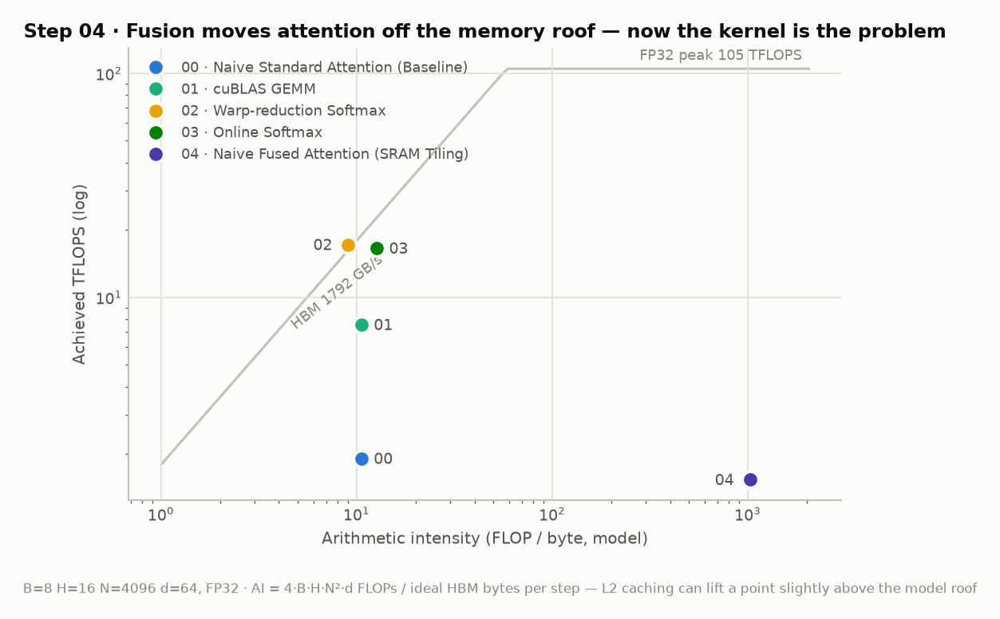

# Step 04 · Naive Fused Attention (SRAM Tiling)

> One kernel computes `O = softmax(scale·QKᵀ)V` end-to-end; the N×N score
> matrix never touches HBM. The traffic model drops **81×** (40.5 → 0.5 GiB)
> and the OOM wall disappears — yet the kernel runs at **358 ms, 11× slower
> than step 03**. Getting the FLOPs back is the job of steps 05–09.

- Code: [`steps/04_naive_fused/kernels.cu`](../steps/04_naive_fused/kernels.cu)
- Measurement script: [`benchmarks/bench_step04.py`](../benchmarks/bench_step04.py) ·
  raw numbers: [`benchmarks/results/step04.json`](../benchmarks/results/step04.json)

## What this step implements

- grid: one block per **Br=8 query rows** of one (batch, head); **one warp per
  query row**; K and V streamed through shared memory in tiles of **Bc=32 rows**
- per row, registers hold the online-softmax state (m, l) and the output
  accumulator (d floats strided across the 32 lanes)
- per tile: lane c computes the full dot product q·k_c → tile max via warp
  shuffle → unnormalized p_c → rescale old state by `exp(m − m_new)` → fold
  `P_tile · V_tile` into the accumulator (p_c broadcast from lane c)
- shared memory: `(Br + 2·Bc)·d·4B` = 18 KB at d=64; single HBM write at the end
- known flaws left for later steps (see comments in `kernels.cu`): K-tile reads
  have **32-way bank conflicts** (stride d) → step 06; scalar FMAs, no tensor
  cores → steps 07–08; no load/compute overlap → step 09

<!-- TODO: 타일링 그림 (Q block × K/V tile 순회), FlashAttention 알고리즘 1과 대응 관계 -->

## Measurements

### Fusing alone is a regression

| | 00 | 01 | 02 | 03 | **04** | PyTorch eager | SDPA (FP16) |
|---|---:|---:|---:|---:|---:|---:|---:|
| Latency (ms) | 288.3 | 72.8 | 32.0 | 33.2 | **358.4** | 40.9 | 2.5 |

### What fusion buys anyway (1): the N² traffic is gone

Unfused must move the score matrix through HBM ~6 times (QK write, softmax
2R+1W, PV read); fused ideally touches only Q, K, V, O — linear in N instead
of quadratic.

### What fusion buys anyway (2): no OOM wall

At B=8 H=16, the unfused pipeline needs the 33 GiB score matrix at N=8192 —
past the 32 GiB VRAM. On WSL2 this shows up not as an OOM but as unified
memory **spilling to host RAM: 49.2 s (~1500× slower)**; at N=16384 it OOMs
outright (scores alone would need 128 GiB). The fused kernel runs N=16384 in
5.2 s using 2.0 GiB.

### Roofline: the bottleneck changed sides

Steps 02–03 sit *on* the memory roof (AI ≈ 10 FLOP/B) — they could not get
faster without moving less data. Fusion raises arithmetic intensity to
AI ≈ 1024, deep into compute-bound territory, but the naive kernel achieves
only **1.5 of 104.8 TFLOPS**. The problem is no longer *where the data lives*
but *how the math is executed*.

<!-- TODO: 1.5 TFLOPS의 원인 분해 — bank conflict / scalar FMA / occupancy를
     ncu 지표로 정량화해서 step 05~09 각각이 무엇을 회수하는지 연결 -->

## Concepts to cover (TODO)

- [ ] GPU 메모리 계층 (HBM ↔ L2 ↔ SRAM/smem ↔ register)과 용량·대역폭 수치
- [ ] 타일링 설계: Br/Bc 선택과 smem 예산, 왜 K/V는 Q 블록마다 재로드되는가
- [ ] online softmax 상태를 타일 단위로 merge하는 과정 (step 03과의 연결)
- [ ] shared memory bank conflict가 여기서 어떻게 생기는지 (step 06 예고)
- [ ] "memory-bound → compute-bound 전환" 관점에서 FlashAttention 논문 다시 읽기

## Next

→ Step 05 · Coalescing + Vectorized Load: start recovering the compute — fix
how the tiles are loaded before fixing how the math is issued.
